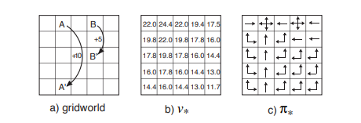

# jumpy-gridworld
Solution of Example 3.8 (shown in the picture below) of Chapter 3 in Sutton Barto book obtained using SARSA algorithm  
  
The Gridworld is described as follows: the cells of the grid correspond to
the states of the environment. At each cell, four actions are possible: `north`,
`south`, `east`, and `west`, which deterministically cause the agent to move one
cell in the respective direction on the grid.  
Actions that would take the agent
off the grid leave its location unchanged, but also result in a reward of −1.
Other actions result in a reward of 0, except those that move the agent out
of the special states `A` and `B`. From state `A`, all four actions yield a reward of
+10 and take the agent to `A0`
. From state `B`, all actions yield a reward of +5
and take the agent to `B0`.
### SARSA ALGORITHM PARAMETERS ###
The used parameters are:
- γ = 0.9
- α = 0.3
- ε = 0.05
- episodes = 1.000.000
 
selected after several trials in order to obtain the result closest to the one indicated by the book.

